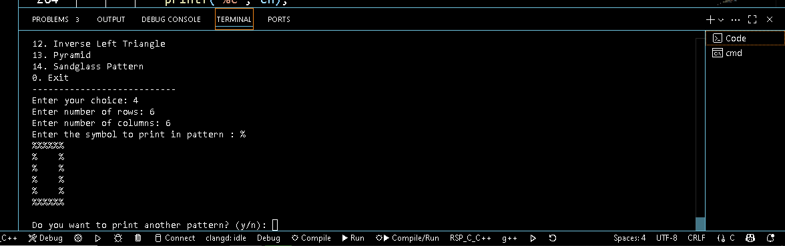

# 🔷 C Pattern Generator Project

This is a **menu-driven C program** that prints a variety of patterns using symbols or numbers. The user can choose 
from multiple options like triangles, boxes, diagonals, Pascal triangle, pyramid, and more.

---

## ✨ Features

- 12+ pattern options including:
  - Right / Inverse / Rotated Triangles
  - Hollow / Full Box Patterns
  - Pascal Triangle (with or without symbols)
  - Diamond and Sandglass Shapes
  - Pyramid and Hollow Triangles
- Supports **custom row, column, and symbol** inputs
- **Clear menu** interface
- Uses **functions for each pattern**

## 📸 Demo Screenshot



---
## 💻 How to Run

1. Compile the program:
   ```bash
   gcc pattern_generator_c.c -o pattern_generator_c
